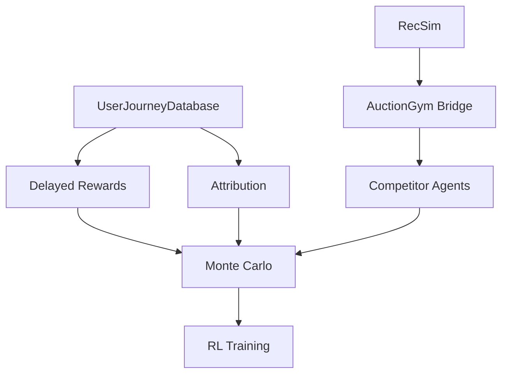

# GAELP Full Implementation Roadmap
## From Current State to Production-Ready System

## 📊 Current State Assessment

### ✅ What We Have Working:
- Basic RL agent (PPO with LSTM)
- Individual components (RecSim, AuctionGym, Criteo)
- Simple single-episode training
- Checkpointing and wandb tracking
- Basic journey tracking concept

### ❌ What's Completely Broken:
- Users reset every episode (no persistence)
- No multi-day journeys
- Competitors don't learn
- Rewards are immediate (not delayed)
- No real attribution

## 🎯 Implementation Phases

### Phase 1: Foundation (Week 1) - CRITICAL PATH
**Goal: Get multi-day journeys working**

1. **Create UserJourneyDatabase** ⭐ HIGHEST PRIORITY
   - Persist users across episodes
   - Track journey state (UNAWARE → CONVERTED)
   - Store touchpoint history
   - Handle journey timeouts (>14 days)
   - **File:** `user_journey_database.py`
   - **Effort:** 2 days

2. **Implement Delayed Reward Mechanism** ⭐ CRITICAL
   - Store pending rewards
   - Attribute when conversion happens
   - Handle partial episodes
   - **File:** `delayed_reward_system.py`
   - **Effort:** 1 day

3. **Connect RecSim → AuctionGym** ⭐ CRITICAL
   - Map RecSim users to auction participants
   - Generate queries based on user state
   - Feed RecSim signals to auction
   - **File:** `recsim_auction_bridge.py`
   - **Effort:** 2 days

### Phase 2: Competition & Attribution (Week 1-2)
**Goal: Make it realistic**

4. **Build CompetitorAgents**
   - Q-learning for Qustodio
   - Policy gradient for Bark
   - Rule-based for Circle
   - Agents that learn from losses
   - **File:** `competitor_agents.py`
   - **Effort:** 3 days

5. **Implement Multi-Touch Attribution**
   - Time-decay model
   - Position-based (U-shaped)
   - Data-driven attribution
   - **File:** `attribution_models.py`
   - **Effort:** 2 days

6. **Create State Representation v2**
   - Include journey sequence features
   - Add competitor exposure tracking
   - Encode user progression
   - **File:** `journey_state_encoder.py`
   - **Effort:** 1 day

### Phase 3: Scale & Optimization (Week 2)
**Goal: Learn efficiently**

7. **Monte Carlo Parallel Simulation**
   - Run 100+ worlds in parallel
   - Different random seeds per world
   - Aggregate experiences
   - **File:** `monte_carlo_simulator.py`
   - **Effort:** 2 days

8. **Importance Sampling**
   - Weight rare valuable events (crisis parents)
   - Adjust for sampling bias
   - **File:** `importance_sampler.py`
   - **Effort:** 1 day

9. **Budget Pacing System**
   - Hourly budget allocation
   - Intraday pacing
   - Budget reallocation
   - **File:** `budget_pacer.py`
   - **Effort:** 1 day

### Phase 4: Intelligence (Week 3)
**Goal: Smart targeting**

10. **Creative Selection System**
    - Map user state → ad creative
    - A/B test tracking
    - Creative fatigue modeling
    - **File:** `creative_selector.py`
    - **Effort:** 2 days

11. **Identity Resolution**
    - Probabilistic user matching
    - Cross-device tracking
    - Session stitching
    - **File:** `identity_resolver.py`
    - **Effort:** 2 days

12. **Integrate Criteo CTR Patterns**
    - Use real CTR data for response modeling
    - Feature engineering from Criteo
    - **File:** `criteo_response_model.py`
    - **Effort:** 1 day

### Phase 5: Advanced Features (Week 3-4)
**Goal: Production readiness**

13. **Seasonality & Time Effects**
    - Back-to-school patterns
    - Day-of-week effects
    - Hour-of-day optimization
    - **File:** `temporal_effects.py`
    - **Effort:** 1 day

14. **Competitive Intelligence**
    - Estimate competitor bids
    - Partial observability handling
    - Market share tracking
    - **File:** `competitive_intel.py`
    - **Effort:** 2 days

15. **Conversion Lag Modeling**
    - Handle 30+ day conversion windows
    - Survival analysis for timeout
    - **File:** `conversion_lag_model.py`
    - **Effort:** 1 day

### Phase 6: Safety & Monitoring (Week 4)
**Goal: Don't lose money**

16. **Safety Checks**
    - Max bid caps
    - Budget circuit breakers
    - Anomaly detection
    - **File:** `safety_system.py`
    - **Effort:** 1 day

17. **Evaluation Framework**
    - Holdout test set
    - A/B testing capability
    - Statistical significance
    - **File:** `evaluation_framework.py`
    - **Effort:** 2 days

18. **Online Learning**
    - Learn while serving
    - Exploration vs exploitation
    - **File:** `online_learner.py`
    - **Effort:** 2 days

### Phase 7: Integration (Week 5)
**Goal: Connect everything**

19. **System Orchestrator**
    - Wire all components together
    - Config management
    - Error handling
    - **File:** `system_orchestrator.py`
    - **Effort:** 3 days

20. **Production Pipeline**
    - Data pipelines
    - Model serving
    - API endpoints
    - **File:** `production_pipeline.py`
    - **Effort:** 3 days

## 📋 Quick Start Order (Do These First!)

### Week 1 Sprint (MUST HAVE):
1. **UserJourneyDatabase** - Nothing works without this
2. **Delayed Rewards** - Core to multi-touch
3. **RecSim→AuctionGym** - Connect our components
4. **CompetitorAgents** - Basic version
5. **Attribution** - At least time-decay

### If you only have 3 days:
1. UserJourneyDatabase (Day 1-2)
2. Delayed Rewards (Day 2)
3. Simple Attribution (Day 3)

## 🚧 Technical Dependencies



## 🎯 Success Metrics

### Minimum Viable System:
- [ ] Can track user across 7-day journey
- [ ] Rewards assigned after conversion delay
- [ ] At least 3 competitors bidding
- [ ] Basic attribution (not just last-click)
- [ ] State includes journey history

### Production Ready:
- [ ] 100+ parallel simulations
- [ ] Competitors adapt strategies
- [ ] Multiple attribution models
- [ ] Creative selection working
- [ ] Budget pacing active
- [ ] Safety checks in place
- [ ] CAC < $100 achieved
- [ ] ROAS > 2x maintained

## 💻 Implementation Order (Recommended)

```python
# Day 1-2: Foundation
implement_user_journey_database()
implement_delayed_rewards()

# Day 3-4: Connect systems
connect_recsim_to_auctiongym()
create_basic_competitors()

# Day 5-6: Attribution
implement_attribution_models()
update_state_representation()

# Day 7-8: Scale
add_monte_carlo_simulation()
add_importance_sampling()

# Day 9-10: Intelligence
add_creative_selection()
add_budget_pacing()

# Day 11-12: Testing
create_evaluation_framework()
run_integration_tests()

# Day 13-14: Safety
add_safety_checks()
add_monitoring()

# Day 15+: Optimization
tune_hyperparameters()
optimize_performance()
```

## 🔴 Biggest Risks

1. **UserJourneyDatabase complexity** - This touches everything
2. **Delayed rewards** - Tricky to debug
3. **Competitor learning** - Could destabilize training
4. **Attribution accuracy** - Hard to validate
5. **System integration** - Many moving parts

## ✅ Definition of Done

The system is complete when:
1. Can simulate 30-day campaign with 10,000 users
2. Users persist across episodes with multi-day journeys
3. Competitors adapt strategies based on losses
4. Attribution splits credit across touchpoints
5. Agent achieves CAC < $100 consistently
6. System runs at 1000+ users/second
7. All safety checks pass
8. Evaluation shows statistical significance

## 🚀 Next Immediate Step

**START WITH:** `user_journey_database.py`

This is the foundation everything else depends on. Without persistent users, nothing else matters.

```python
# First code to write:
class UserJourneyDatabase:
    def __init__(self):
        self.journeys = {}  # user_id -> Journey
        
    def get_or_create_journey(self, user_id):
        if user_id not in self.journeys:
            self.journeys[user_id] = Journey(user_id)
        return self.journeys[user_id]
```

Then immediately test it works across episodes!